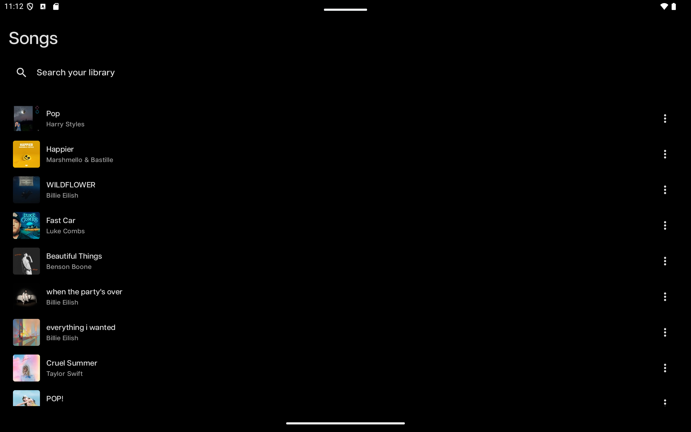
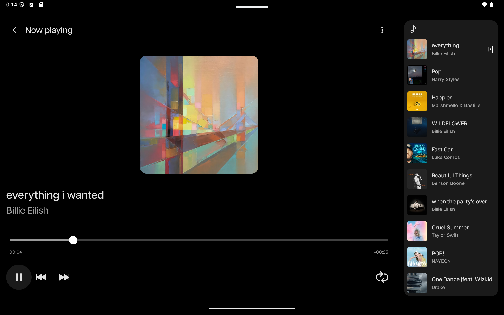
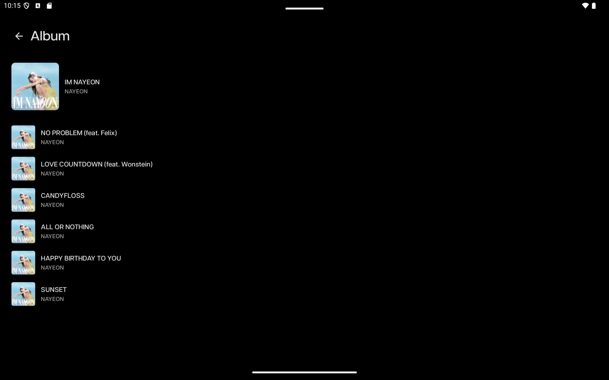
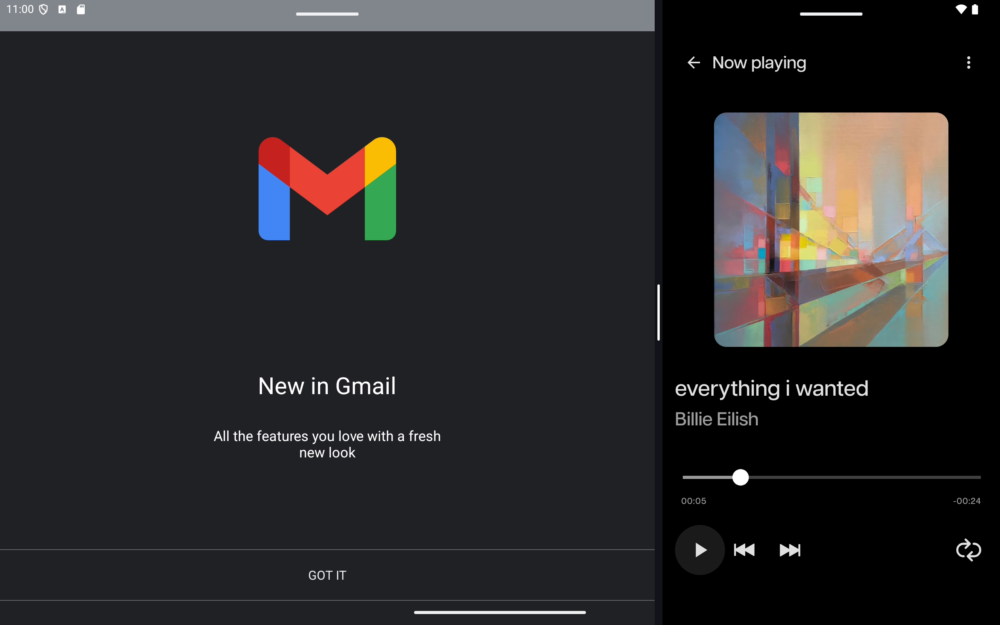

Dear Reviewer,

I put a lot of effort into this challenge and completed all mandatory requirements, along with several bonus items. I hope to be selected for the next stage.

Thank you for the opportunity to participate in this process.

## Project Style

- Modular architecture with clear boundaries:
  - `app/`: Android application module
  - `core/`: shared foundations (`common`, `networking`, `navigation`, `ui`)
  - `feature/`: feature modules (`home`, `player`)
  - `build-logic/`: centralized custom Gradle convention plugins
- MVVM with unidirectional data flow
- Please note that in the pagination, API is sending same data even when a offset is set :)

## Bonus Items Implemented

- Error and state handling
- Swipe-to-refresh
- Repository organization
- Player screen improvements:
  - Forward/backward actions
  - Slider action to seek a specific position
- Song timeline display (mandatory) and timeline seek support via drag (optional)
- Thoughtful handling of portrait vs. landscape layouts

## Screenshots

  
  
  

